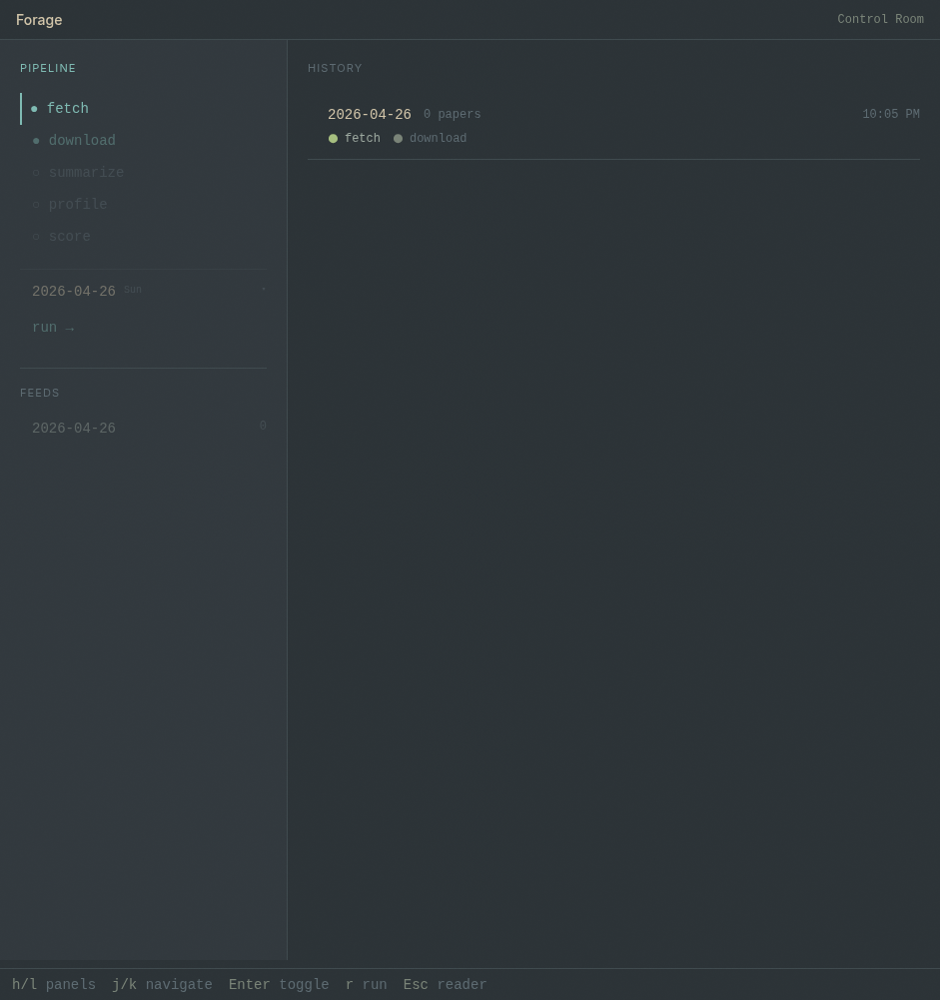
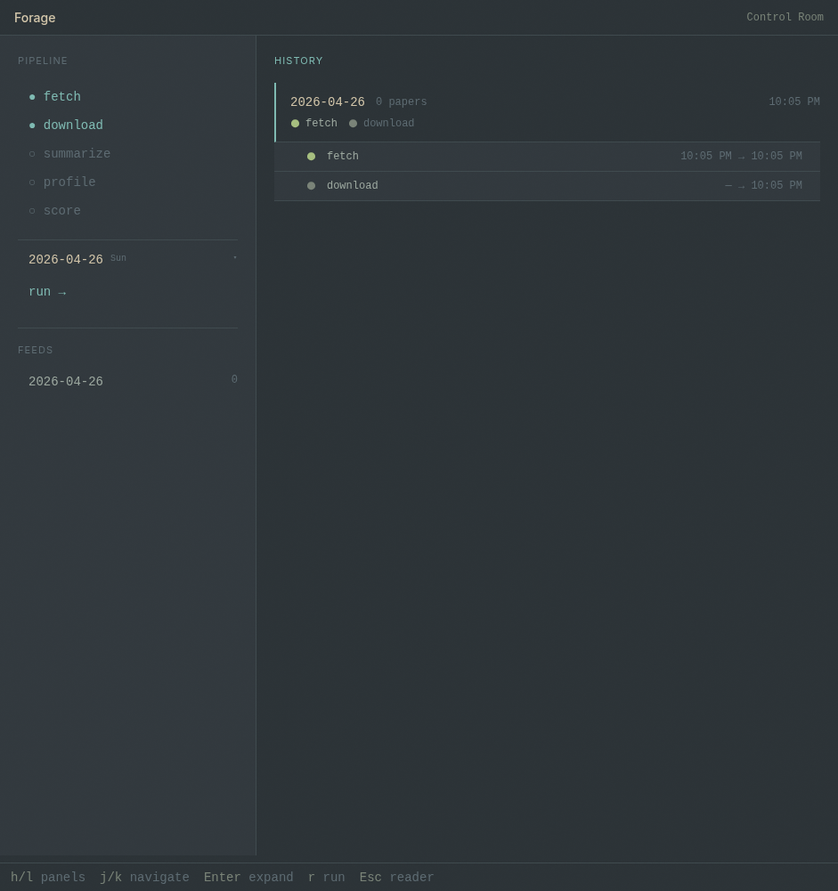
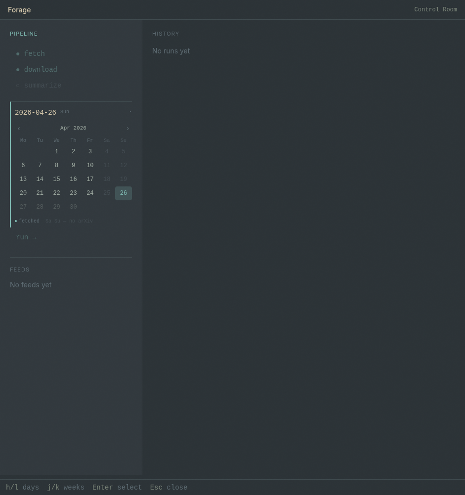
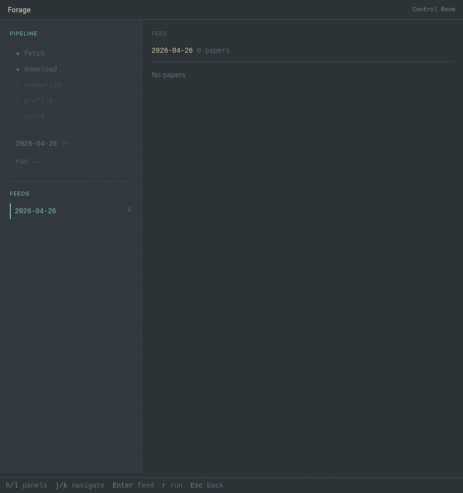

# Forage

**Forage for knowledge.** A desktop reader that pulls research papers from arXiv, summarizes them with AI, learns what you care about, and scores every paper for relevance — so the work that matters rises to the top of your feed.



Forage is a single-user, bring-your-own-key desktop app for staying on top of research. Point it at an arXiv category and a date; it fetches that day's papers, downloads each one's LaTeX source, writes a plain-language summary, builds a profile from the papers you like and dismiss, and scores new papers against that profile.

It is built as an Electron app with a fully typed, event-driven pipeline and two distinct workspaces: a keyboard-driven **Reader** for triaging papers, and a mouse-driven **Control Room** for running and observing the pipeline.

> Status: v0.1 — verified end-to-end on live arXiv data (fetch → download → summarize → profile → score).

## Features

- **End-to-end paper pipeline** — five composable steps (fetch, download, summarize, profile, score) orchestrated with full cancellation support.
- **AI summaries** — an agent reads each paper's LaTeX source (or falls back to the abstract) and writes a concise description plus a structured markdown summary.
- **Preference learning** — an agent distills your liked and dismissed history into an interest profile: topics, dismissal patterns, category and author affinity.
- **Relevance scoring** — every paper is scored 0–1 against your active profile, with a short reasoning note, and the feed sorts by score.
- **Reader** — a keyboard-first feed and split view; navigate and label papers without touching the mouse.
- **Control Room** — pick a date, choose which steps to run, and watch per-paper progress stream in live. Runs are cancellable mid-flight.
- **Local-first** — your data lives in your own Postgres and AI calls go through your own OpenRouter key. No accounts, no servers.

## Screenshots

| | |
|---|---|
| <br>Expanded run — per-step job timeline | <br>Feed-aware date picker |
| <br>Feed detail — per-paper step status | |

## How it works

The pipeline runs as five steps; each writes to Postgres and emits progress events to the UI:

1. **Fetch** — query the arXiv API for a category and date, deduplicating against papers already stored.
2. **Download** — pull each paper's e-print source (LaTeX / tar), falling back to the PDF when no source is available.
3. **Summarize** — an agent lists and reads the source files (bounded by tools) and produces a structured summary.
4. **Profile** — an agent reads your liked and dismissed papers and category stats, then writes an interest profile.
5. **Score** — an agent rates each new paper against the active profile and records a score plus reasoning.

The whole run is driven by an `AbortController`: cancellation threads through every network call, agent run, and sleep, so a run stops cleanly the moment you cancel it.

## Tech stack

- **Runtime** — Electron (Electron Forge + the Vite plugin)
- **Language** — TypeScript across main, preload, renderer, and shared code
- **UI** — React 19, Tailwind CSS v4, Zustand
- **Database** — Postgres 16, accessed through `postgres` (Porsager) with raw tagged-template SQL — no ORM
- **AI** — OpenAI Agents SDK (`@openai/agents`) with Zod-typed structured outputs, routed through OpenRouter
- **Source** — the arXiv API

## Architecture

Forage follows a strict one-directional layering in the main process:

```
ipc/  →  services/  →  ( queries | sources | agents | storage )
```

- **Event-driven, no polling.** Three push events — `paper:status`, `run:update`, `job:update` — stream pipeline state from main to renderer. Services own their database writes and emit events for the UI.
- **Cancellable by construction.** One `AbortController` per run; the signal is the last argument on every I/O function and is threaded through `fetch`, agent runs, and interruptible sleeps.
- **Typed boundaries.** Shared types, enums, and event payloads live in `src/shared/`, and the IPC contract is a single typed source of truth.

Deeper notes live in [`docs/`](docs/index.md) — schema, pipeline flow, agent specs, design system, and vim keybindings.

## Getting started

### Prerequisites

- Node.js 20 or newer
- Docker, for the local Postgres — or any Postgres 16 instance
- An [OpenRouter](https://openrouter.ai) API key

### Setup

```bash
# 1. Install dependencies
npm install

# 2. Configure environment
cp .env.example .env
#    then edit .env and add your OPENROUTER_API_KEY

# 3. Start Postgres (host port 5433)
docker compose up -d

# 4. Launch the app (migrations run automatically on first start)
npm start
```

### Dev scripts

Standalone harnesses (run with `tsx`) exercise pieces of the pipeline without the UI:

```bash
npx tsx src/main/scripts/test-fetch.ts        # arXiv fetch + download
npx tsx src/main/scripts/test-agents.ts       # summary, profile, and scoring agents
npx tsx src/main/scripts/run-pipeline-dev.ts  # full pipeline against a test database
```

Lint with `npm run lint`.

## Project layout

```
src/main/      Electron main process (db, services, sources, agents, ipc)
src/preload/   contextBridge surface
src/renderer/  React UI (reader/, control/, components/, stores/, hooks/)
src/shared/    shared types, enums, event payloads
docs/          living reference docs
```

## Roadmap

- **Lab** zone for ad-hoc agent runs and model comparison (schema groundwork in place).
- Additional sources beyond arXiv (blogs, journals).
- Packaged installers via Electron Forge makers.

## License

[MIT](LICENSE) © Ruskin Patel
